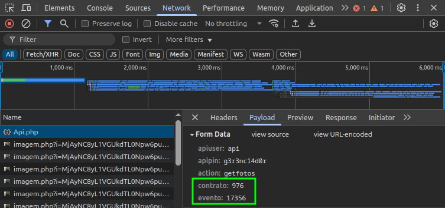

# difoccus-dl

## Como usar

```bash
npx difoccus-dl -c <contrato> -e <evento...>
```

Você precisa do código do contrato e dos eventos, é possível adquirir a partir da chamada à Api quando se abre uma galeria de fotos.



### Exemplo

```bash
npx difoccus-dl -c 976 -e 17356
```
