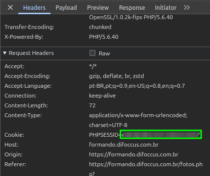

# difoccus-dl

## Como usar

```bash
npx difoccus-dl -s <sessao> -c <contrato> -e <evento...>
```

Primeiro você precisa do valor do cookie de sessão PHPSESSID, que deve ser optido ao logar em [formando.difoccus.com.br](https://formando.difoccus.com.br/).



Depois é preciso do código do contrato e dos eventos a partir da chamada à Api quando se abre uma galeria de fotos.


### Exemplo

```bash
npx difoccus-dl -s blablabla -c 976 -e 17356
```
